# Alpha-Zulu quiz (3 points)

Ahoy, officer

your task is to pass a test that is part of the crew drill. Because of your rank of third officer, you must lead the
crew by example and pass the test without a single mistake.

May you have fair winds and following seas!

The quiz webpage is available at http://quiz.cns-jv.tcc.

## Hints

* Use VPN to get access to the quiz web.

## Solution

The website hosts a quiz form that asks us to identify various blobs (in random order). They can be identified by some
known file beginnings/substrings (`MZ`, `PK`), using e.g. `file` tool, by length (hashes) or simply by the process of
elimination.

The answers are:

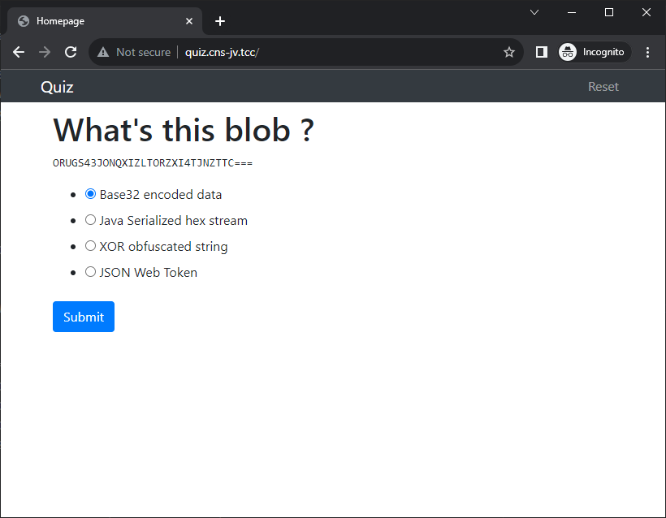
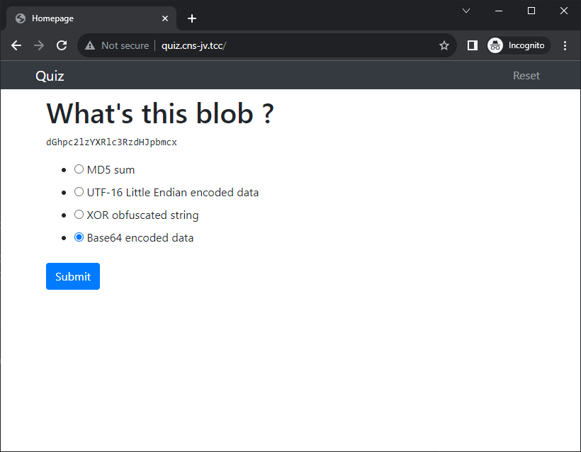
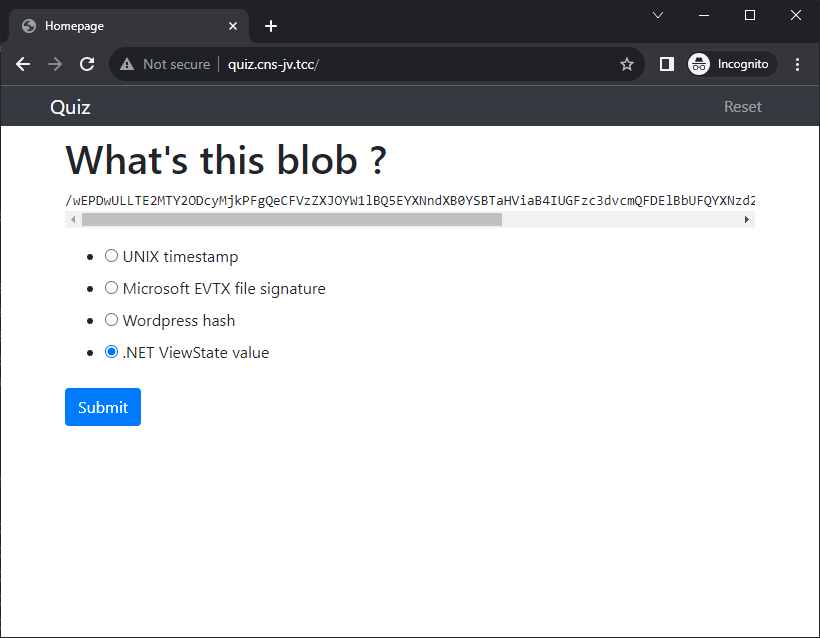
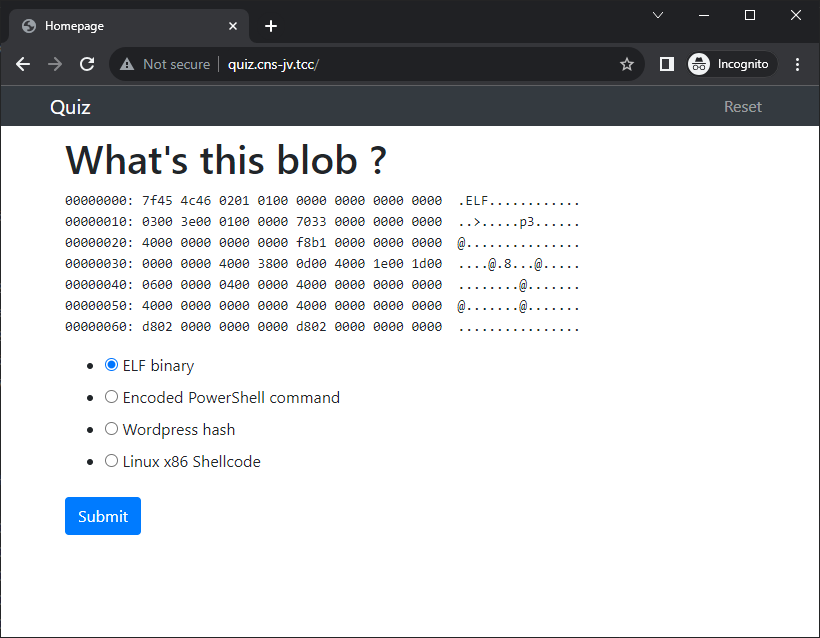
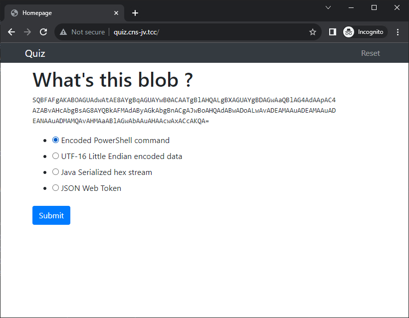
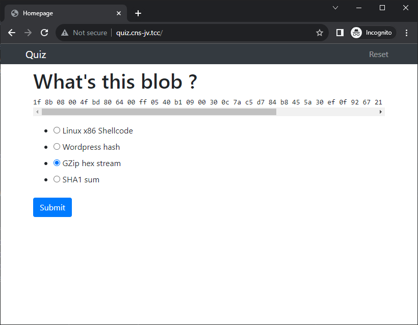
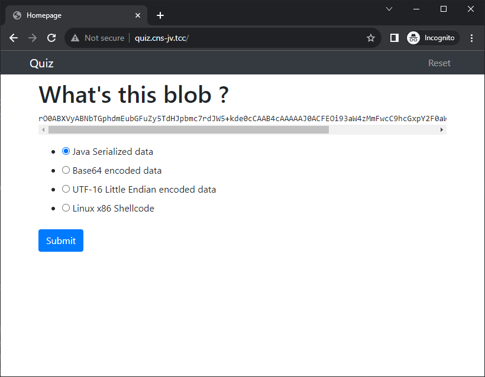
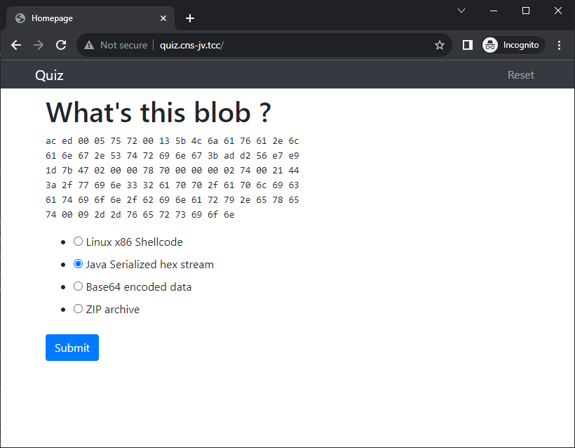

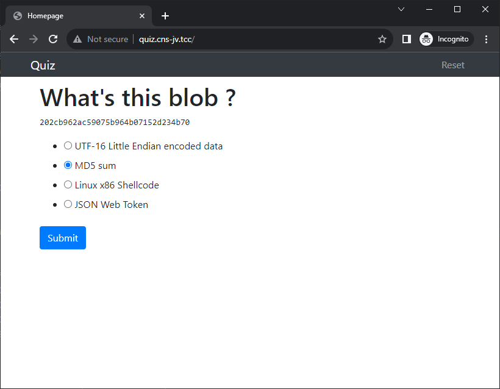
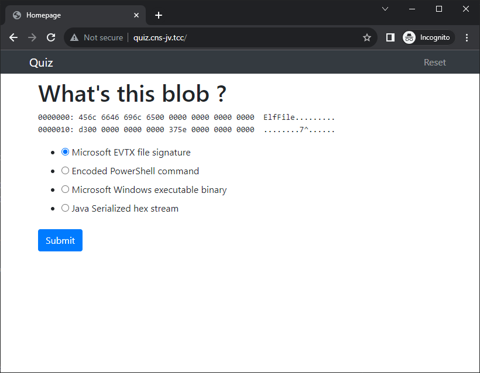
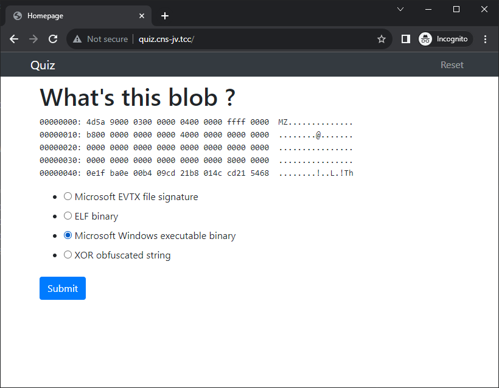
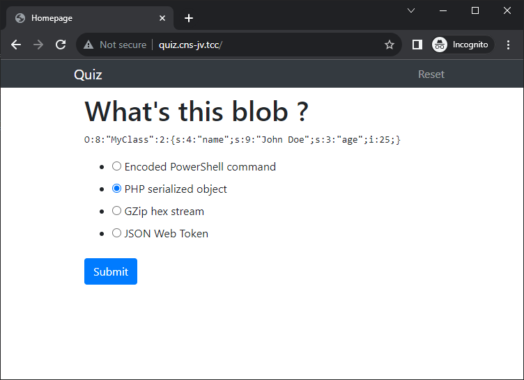
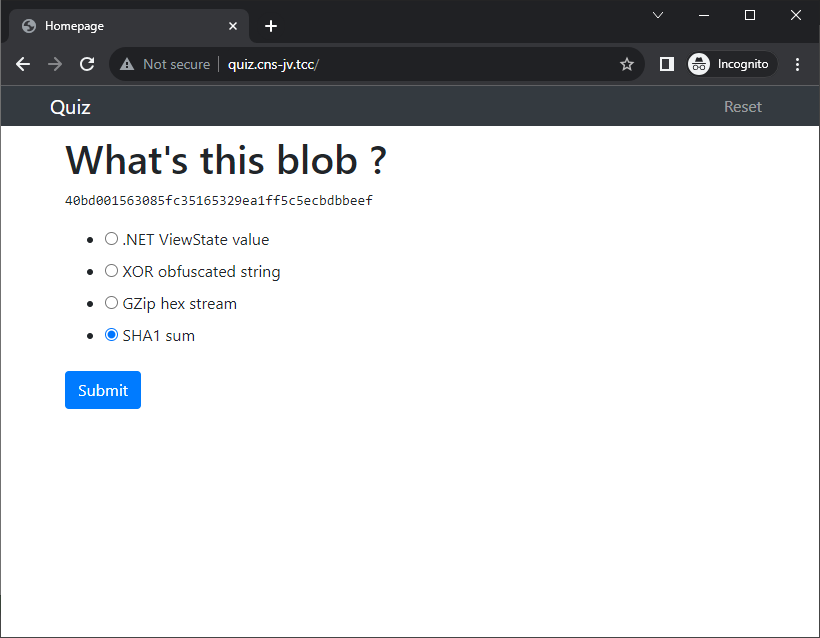
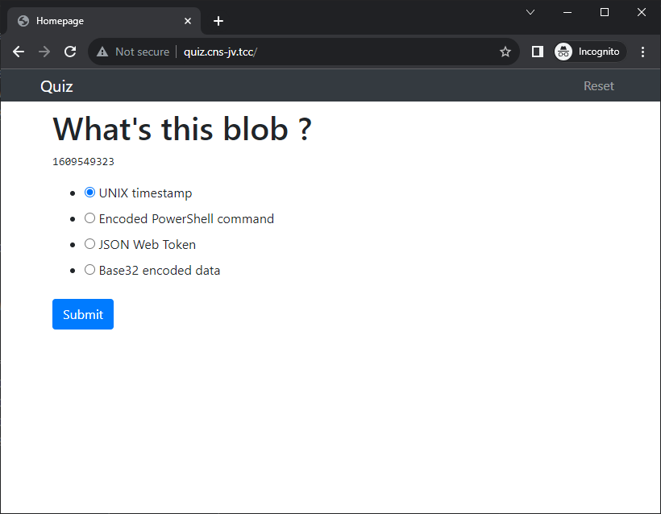
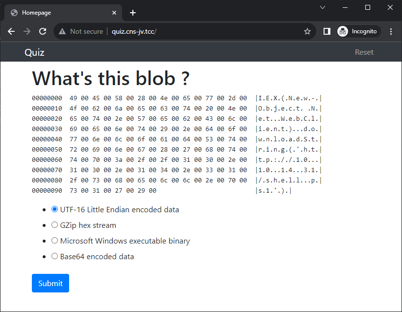

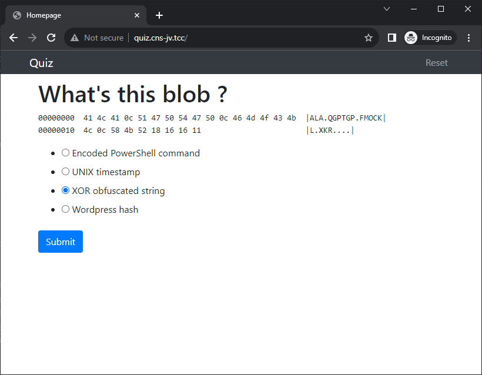
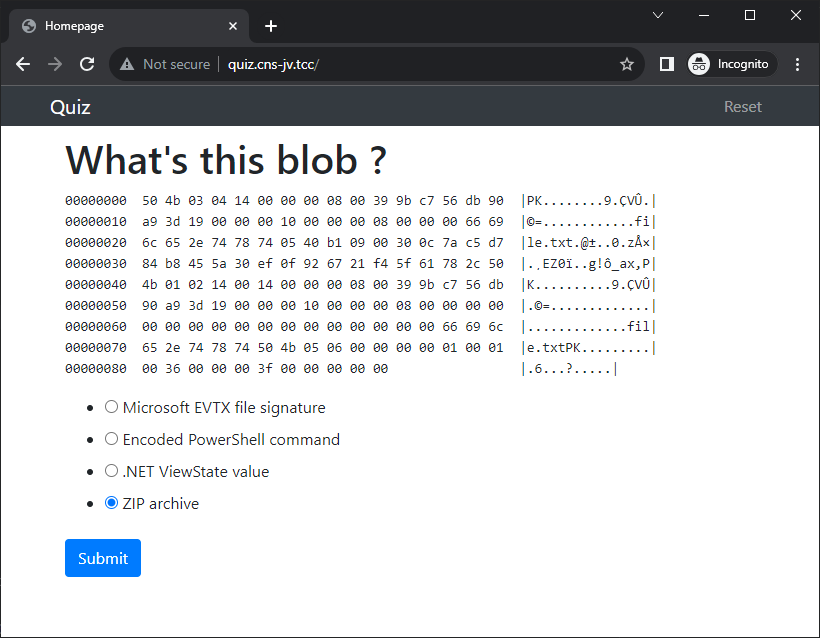

After successfully answering all the questions the quiz continues, but the flag is revealed.
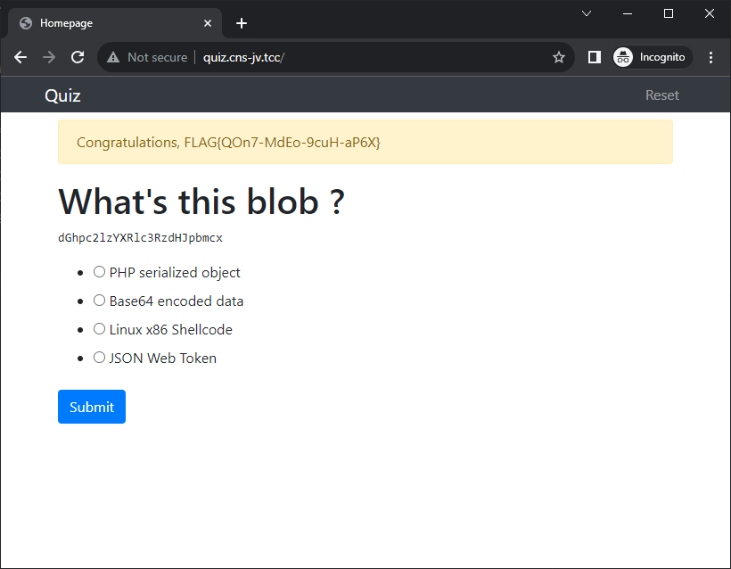
