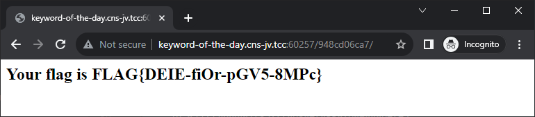

# Keyword of the day (4 points)

Ahoy, officer,

one of deck cadets (remember your early days onboard) had a simple task to prepare simple web application to announce
keyword of the day. He claimed that the task is completed, but he forgot on which port the application is running.
Unfortunately, he also prepared a lot of fake applications, he claims it was necessary for security reasons. Find the
keyword of the day, so daily routines on ship can continue.

May you have fair winds and following seas!

The webs are running somewhere on server `keyword-of-the-day.cns-jv.tcc`.

## Hints

* Use VPN to get access to the server.

## Solution

The description indicates that there should be many websites/applications on the host. Let's scan.

_Note: If you forget to include the "scan all ports" flag when invoking `nmap` the scan will yield just one of them.
Therefore, I am very grateful to the orgs that they included this hint in the task description._

```console
$ nmap keyword-of-the-day.cns-jv.tcc -p-
Nmap scan report for keyword-of-the-day.cns-jv.tcc (10.99.0.155)
Host is up (0.035s latency).
Not shown: 65301 closed tcp ports (conn-refused)
PORT      STATE SERVICE
60000/tcp open  unknown
60004/tcp open  unknown
...(a lot of ports omitted for clarity)...
60494/tcp open  unknown
60495/tcp open  unknown
```

If we try to open any of those websites we'll find out that it does something (obfuscated JS) for a while and then
displays a random smiley face. Let's check if all these webpages differ somehow. I.e. let's save all of them to the
filesystem, calculate checksums and check how many of each there are.

```console
$ nmap keyword-of-the-day.cns-jv.tcc -p 60000-60495 | grep -o "^60..." | while read port; do curl -s http://keyword-of-the-day.cns-jv.tcc:$port > $port.html; done

$ sha1sum.exe 60*html > checksum.sha1

$ cut -d' ' -f1 checksum.sha1 | sort | uniq -c
     11 04a8b02794407ca56e089e5d76783c64438e2ff5
      9 04c927a3fb8704ea3c9421b4d33873c3e42b9e0c
     10 1306b0177fcb4407611f91f193dab1258ef9c57c
      1 15085c50f48be6d21bb9881a80451f51a7391946
     10 31f2a6a9038f5d6ebaffc90db6ea4a98274ccc6d
     10 41a5c86a6ff7eface468f107db4d6f4a463d3812
     10 499e748319507810a3ec1cba361e5721c90d5602
     10 5300b5846b82302c9098f315db96f1464ae20aad
     10 5fe4c48d6913031c39d22cac958885cfc81fa7de
      9 69b72c3a9327260e170c1f9855beb8f00155e191
     10 6d809ad4ebeb30ae98e2936b2a65b731c14c2b7a
     10 6f96637d24cab3e47bb595d49de4f7ffd82e2760
      7 74bd7fa1033b6d1e9b526c734910450d3718d82c
      9 9a1b61d3c3f60173af554be565fe1355f1cfedd8
     10 a22722eea8b1462344806ef4a55c39bfbab0f4f7
     10 a6a07f13dfcd6fb21d15a29703b64d18a914a7b0
     10 ab6fa176220296048dada88bc0a4c9652834c34f
      9 b259b2b91c0eb0d98a6446e6a0b11ffb3b16aab2
     10 b40b802572180f240414250e65127f2e5508698c
      8 b4a759e04c9ce55468e6f35cf6226335704c0e32
     10 c8535da07047918de995eff8b31f236e2bd85344
     10 cfdf1674fbd7ae293583aa03389b28143ac50509
     10 d5b36ad6807864195c0a7797d0bee76f02e671a7
     10 e053a54405d43a934e9091cef52bdb2f3c488c09
     11 f1c55f90bdae8dce2ea1fe02587c0fbc991208dc
```

It seems that even though there really are many versions of the app, there are just 25 unique ones. Even more
interestingly, one of them appears only once. Let's check which one it is.

```console
$ grep 15085c50f48be6d21bb9881a80451f51a7391946 checksum.sha1
15085c50f48be6d21bb9881a80451f51a7391946 *60257.html
```

Let's open the one running on port `60257` then.


Now we just need to open the correct URL to retrieve the flag


