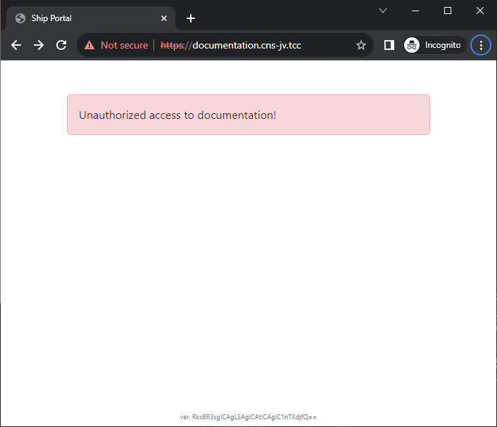
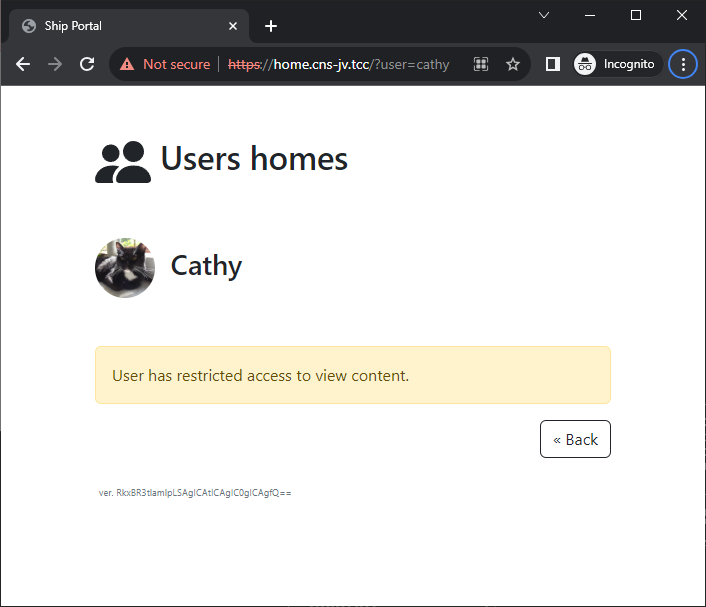
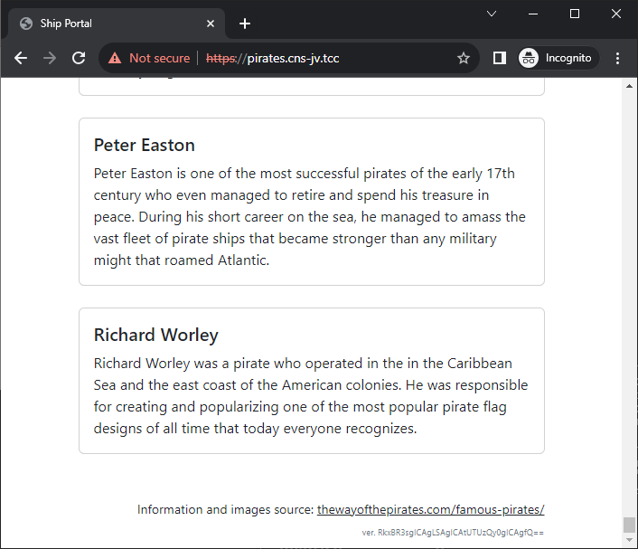
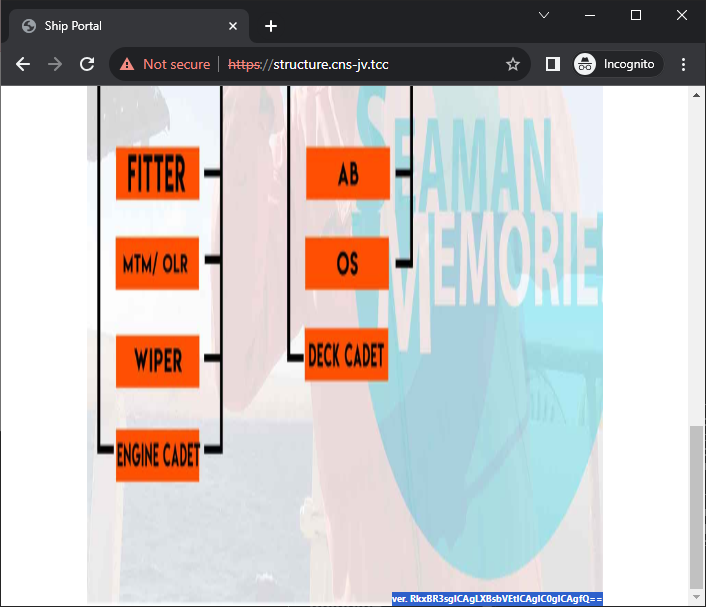

# Ship web server (1 point)

Ahoy, deck cadet,

there are rumors that on the ship web server is not just the official presentation. Your task is to disprove or confirm
these rumors.

May you have fair winds and following seas!

Ship web server is available at http://www.cns-jv.tcc.

## Hints

* Use VPN to get access to the ship web server.
* Check the content of the certificate of the web.
* Visit the other web sites hosted on the same server. Don't let non-existent DNS records to stop you.

## Solution

The website provided in the task description opens, but does not contain any flag. As the hint suggests, let's check the
content of the certificate

```
$ openssl s_client -connect www.cns-jv.tcc:443 </dev/null | openssl x509 -noout -text
depth=0 C = CS, ST = CESNET, L = Maritime Communications, O = CNS Josef Verich, OU = Headquarters, CN = CESNET Maritime Communications
verify error:num=18:self-signed certificate
verify return:1
depth=0 C = CS, ST = CESNET, L = Maritime Communications, O = CNS Josef Verich, OU = Headquarters, CN = CESNET Maritime Communications
verify return:1
DONE
Certificate:
    Data:
        Version: 3 (0x2)
        Serial Number:
            78:92:5f:f2:44:bf:f8:75:2c:73:c3:11:cd:60:dc:5c:13:6f:72:e2
        Signature Algorithm: sha256WithRSAEncryption
        Issuer: C = CS, ST = CESNET, L = Maritime Communications, O = CNS Josef Verich, OU = Headquarters, CN = CESNET Maritime Communications
        Validity
            Not Before: Oct  4 12:01:38 2023 GMT
            Not After : Oct  3 12:01:38 2024 GMT
        Subject: C = CS, ST = CESNET, L = Maritime Communications, O = CNS Josef Verich, OU = Headquarters, CN = CESNET Maritime Communications
        Subject Public Key Info:
            Public Key Algorithm: rsaEncryption
                Public-Key: (4096 bit)
                Modulus:
                    00:f3:92:77:51:27:5b:4b:ba:da:37:d3:f0:d3:05:
                    f4:20:cd:00:38:a6:d7:df:86:1f:b0:fa:d5:3e:6a:
                    e8:f4:9d:9d:e6:32:04:15:d9:aa:7a:b0:12:27:0b:
                    24:f0:1a:82:84:79:42:33:07:fc:a7:d4:36:d4:0d:
                    f0:85:dc:d8:c6:cd:b2:03:12:e2:0c:9e:ea:42:60:
                    bc:8a:e1:91:b0:63:58:ea:00:8a:97:67:0b:14:ea:
                    8b:2f:01:3e:83:29:f7:b0:cc:a5:3d:da:f7:81:79:
                    b6:af:96:74:d2:0c:8d:4f:86:fb:c9:11:52:a9:47:
                    e1:60:6c:de:95:23:4c:30:6a:7e:72:0f:f0:3c:8e:
                    c4:d2:68:0d:d7:3b:bf:67:e4:32:e6:c7:41:00:5c:
                    65:d7:e2:e7:94:5e:72:ef:b1:41:df:05:de:01:39:
                    7e:b0:da:32:a8:57:3f:42:52:4e:1f:58:97:2e:30:
                    0e:37:2a:10:bb:36:5a:f1:e0:80:8b:20:d5:57:5b:
                    46:a7:3c:f5:18:49:67:4d:f0:21:ce:95:e5:e0:ed:
                    f8:e8:ce:68:3e:4d:7e:be:c1:00:e0:21:47:db:55:
                    b4:b3:64:ac:ee:93:4c:01:1d:52:93:c8:05:97:01:
                    9a:ee:13:98:ab:66:32:d5:35:09:ee:48:f7:d1:a2:
                    78:77:f4:8c:e5:3e:6a:b3:3d:74:bd:4d:3d:83:9b:
                    b3:25:2a:3e:da:5d:38:fe:e4:35:86:3a:0e:15:13:
                    b0:ee:ea:77:d7:01:bb:06:1f:76:18:a5:20:ed:9f:
                    6c:2c:37:23:e8:ea:b1:4e:89:df:77:40:e2:4e:47:
                    27:34:da:60:59:e9:07:d6:8c:6a:47:00:17:1d:3b:
                    e0:f1:9b:db:97:b9:78:ec:97:51:80:fb:e7:a2:27:
                    d7:c7:24:53:c5:43:bf:75:35:de:5a:b2:c8:bd:41:
                    7c:32:71:5d:ff:5e:97:45:6a:a9:02:4a:d1:e6:d6:
                    66:1d:dd:8e:8d:8b:45:93:8c:45:5f:99:4b:59:78:
                    dd:62:9b:e0:30:55:e4:cf:df:7b:db:13:b3:41:ea:
                    d2:eb:d8:11:fc:ba:91:60:74:f8:15:b7:d2:3f:d5:
                    d4:f1:ee:64:32:99:54:ee:a3:30:f1:b2:7c:79:4f:
                    06:14:75:3a:c3:90:64:7f:bd:73:63:d2:ba:30:b4:
                    92:51:c6:2f:75:d7:e5:38:70:0e:c2:5b:bb:de:0e:
                    b6:69:9b:8d:d9:57:ed:66:95:14:f2:07:c5:35:1c:
                    bc:8d:bc:74:54:c3:38:9f:1c:96:31:f9:a9:c9:bb:
                    82:b9:71:88:56:16:15:b8:f6:ae:ec:22:5f:20:9d:
                    9f:5d:87
                Exponent: 65537 (0x10001)
        X509v3 extensions:
            X509v3 Subject Key Identifier:
                50:4F:A1:21:78:CB:42:96:44:EB:9C:DA:C2:49:72:3F:09:7F:5A:45
            X509v3 Authority Key Identifier:
                50:4F:A1:21:78:CB:42:96:44:EB:9C:DA:C2:49:72:3F:09:7F:5A:45
            X509v3 Basic Constraints: critical
                CA:TRUE
            X509v3 Subject Alternative Name:
                DNS:www.cns-jv.tcc, DNS:documentation.cns-jv.tcc, DNS:home.cns-jv.tcc, DNS:pirates.cns-jv.tcc, DNS:structure.cns-jv.tcc
    Signature Algorithm: sha256WithRSAEncryption
    Signature Value:
        87:c8:52:5e:0b:70:f4:fc:3d:0f:dd:ec:58:d8:c6:b8:bc:99:
        84:51:6a:16:cd:7d:89:15:4e:d3:90:10:19:67:cc:28:8e:e2:
        6a:45:03:e1:28:8d:e8:f9:0f:3e:09:84:57:18:e6:f9:52:21:
        e9:c3:d3:89:09:a5:ea:d7:e2:a2:25:5a:aa:77:b8:ff:d9:2c:
        f9:fd:b8:b4:1f:06:5c:2b:2e:6a:9d:d6:df:64:ef:57:0d:e8:
        93:3b:2b:50:d9:d4:e9:1a:0b:e6:95:c4:3a:93:d3:aa:54:fd:
        43:20:83:01:7b:0e:fe:ad:ef:10:1f:c7:89:f4:70:0c:08:cd:
        2f:00:24:5b:e1:d4:41:71:85:91:cd:c4:46:ac:ae:22:c5:27:
        79:1d:0e:48:89:57:bf:68:29:1e:1a:58:fb:b5:85:e0:35:92:
        40:85:ce:a7:8b:49:40:be:e1:e8:bc:f6:4a:aa:eb:13:1c:d9:
        2f:03:42:fb:fd:3c:74:d3:49:6e:fa:50:0d:5a:05:dd:d6:ff:
        02:4b:d5:35:56:8d:e3:ba:2c:a7:b4:e4:48:02:00:ca:7a:d5:
        5e:96:31:e0:4f:a1:63:52:8c:18:d5:5e:3f:95:3c:dc:3c:ce:
        ee:ee:d9:b0:42:64:50:dd:c8:92:95:8f:5b:96:f4:41:bc:a2:
        df:f6:b3:2b:67:68:e6:52:a5:86:aa:9f:cd:2f:22:d8:90:0c:
        c1:80:82:db:ef:39:f7:4d:7c:da:6b:96:89:4e:33:81:1e:5b:
        86:54:a6:3e:54:2d:26:44:ad:5d:9f:c5:a2:36:f9:a0:eb:6e:
        40:ba:ae:39:fd:d7:0d:da:1c:e7:3a:c8:58:7a:01:87:13:5b:
        d4:bf:a6:9b:ab:e3:4d:ce:f4:6a:5c:5d:c3:95:58:94:0a:9c:
        dc:5b:70:98:77:85:1d:9a:dc:a8:aa:51:e6:4a:cb:19:ab:df:
        bb:52:c0:00:83:b0:28:da:d8:7c:c9:b5:70:d4:3d:8b:24:03:
        12:8f:6b:c2:e8:ad:51:a2:b2:a2:b0:d5:4f:2e:55:52:20:6b:
        41:91:51:cc:16:06:6a:69:a0:bf:0c:56:2e:a3:3c:15:22:29:
        cb:bc:32:d9:e9:f5:e1:18:d4:99:55:6d:6e:f0:0a:08:68:33:
        a6:2d:fc:a4:95:28:d8:21:0e:3a:31:f8:4c:d9:e9:36:2e:d9:
        5a:36:07:5c:59:80:c9:9f:75:03:79:06:08:a0:7d:a1:bd:8f:
        0f:e1:82:4d:ba:7b:c1:e3:32:2b:1c:23:24:11:a3:82:28:53:
        09:55:07:8c:5a:8b:79:c9:0f:e0:66:1f:36:35:24:90:fa:aa:
        f4:d7:85:d9:16:f1:9c:76
```

We can see that the `Subject Alternative Name` section contains references not only to `www.cns-jv.tcc` but also to
`documentation.cns-jv.tcc`, `home.cns-jv.tcc`, `pirates.cns-jv.tcc`, `structure.cns-jv.tcc`.

Unfortunately these hostnames don't have their DNS records. However, multiple websites can be hosted on one IP/box so
let's check. One way is to send a modified `Host` header (e.g. via `curl`), however, for this task it's more convenient
to add missing DNS entries to our local `hosts` file for these domains pointing to the same IP as `www.cns-jv.tcc`.

After visiting the sites we can notice base64 encoded strings at the bottom of each page.






After decoding the base64-encoded strings we get

```console
$ echo RkxBR3sgICAgLSAgICAtICAgIC1nTXdjfQ== | base64 -d
FLAG{    -    -    -gMwc}
$ echo RkxBR3tlamlpLSAgICAtICAgIC0gICAgfQ== | base64 -d
FLAG{ejii-    -    -    }
$ echo RkxBR3sgICAgLSAgICAtUTUzQy0gICAgfQ== | base64 -d
FLAG{    -    -Q53C-    }
$ echo RkxBR3sgICAgLXBsbVEtICAgIC0gICAgfQ== | base64 -d
FLAG{    -plmQ-    -    }
```

Then it's just a matter of combining all the fragments together. The result is `FLAG{ejii-plmQ-Q53C-gMwc}`.
