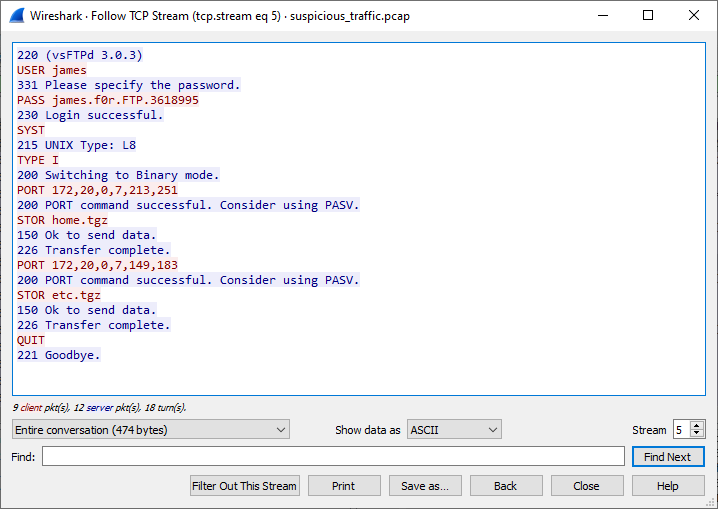
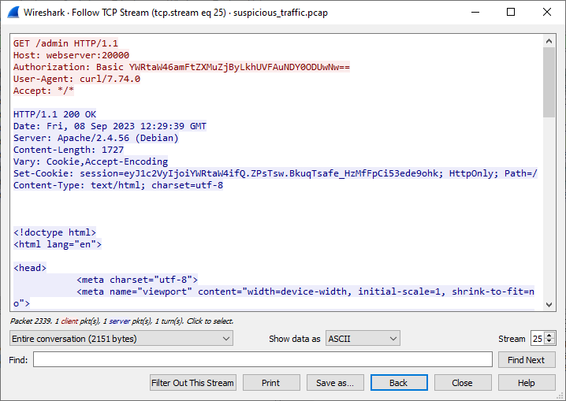
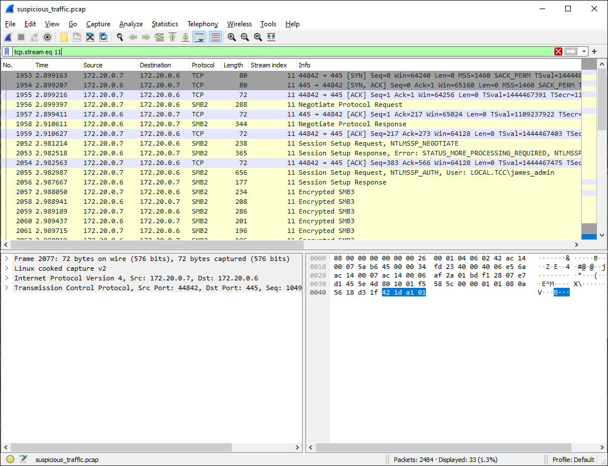
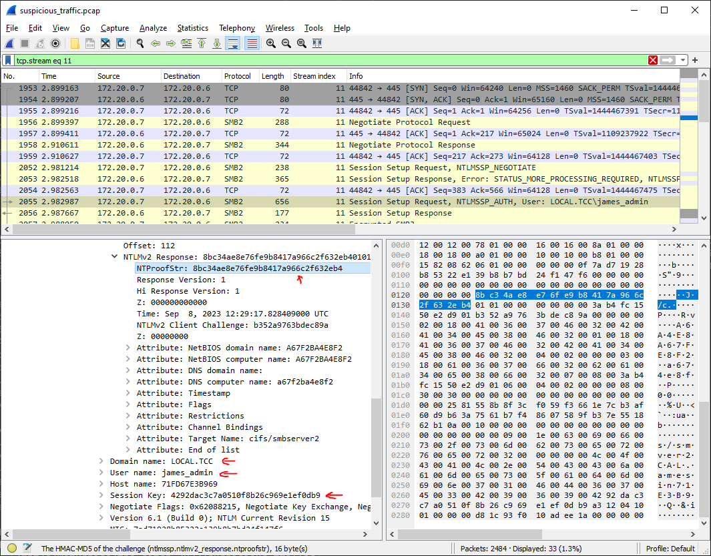
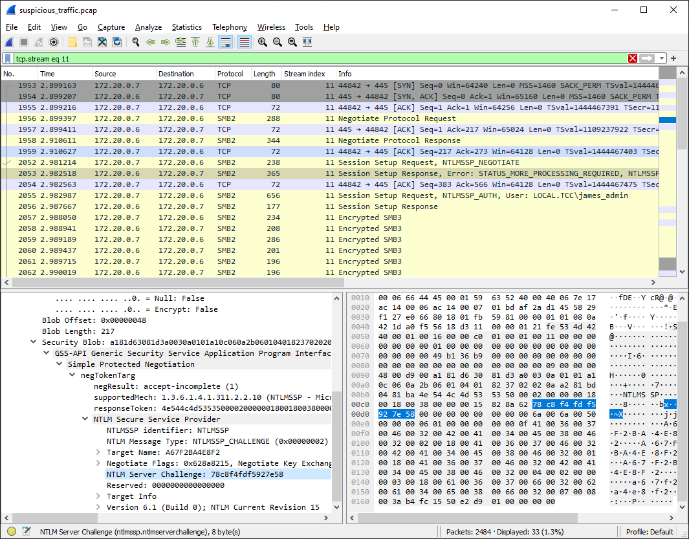
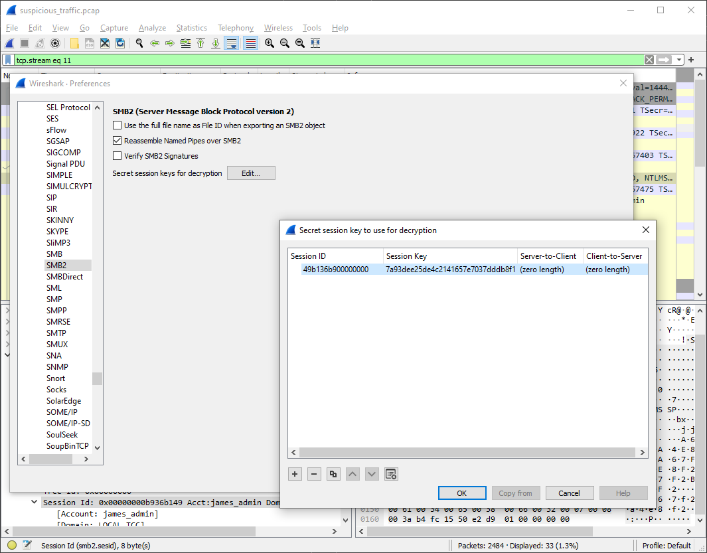
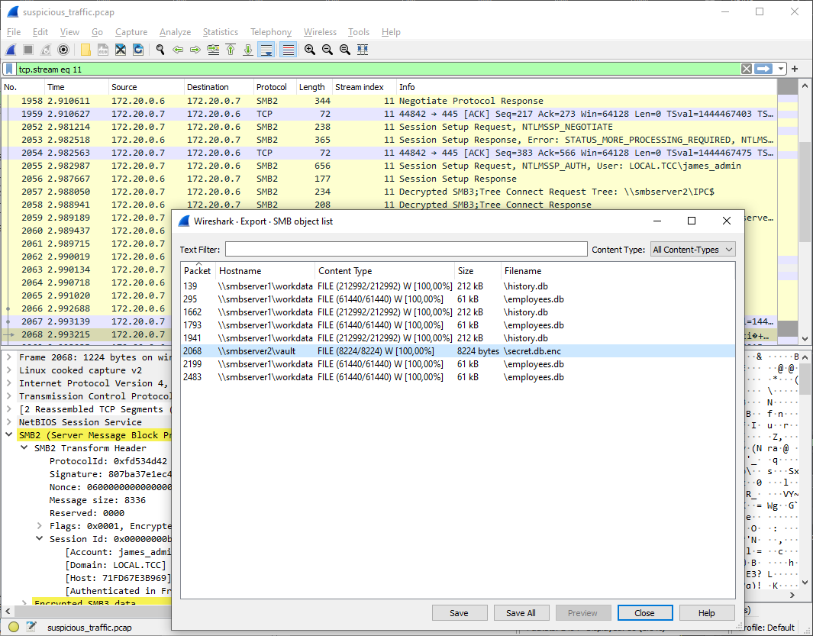

# Suspicious traffic (5 points)

Ahoy, officer,

the chief security officer has told you, he came across a very suspicious event in ship's security logs on the occasion
of a planned monthly log check. The event is related to accessing the secret file `secret.db` on server on cargo deck.
Luckily, the ship is equipped with an automatic network traffic recorder, which was activated by the suspicious event
and provided corresponding packet capture. Your task is to confirm that the mentioned file has been exfiltrated and to
examine its contents.

May you have fair winds and following seas!

Download the [pcap](suspicious_traffic.zip)
(MD5 checksum: `6e7cfe473b222ff766e04196e35df304`)

## Hints

* Do a detailed analysis of the given file, because the main suspect is the auxiliary workforce J. Hook, who is known
  for unusual and impulsive behavior.

## Solution

Let's use [Wireshark] to analyze the extracted pcap file.

If we look well enough, after a while we come across (unencrypted) FTP session (TCP stream #5).



We can clearly see James' password and also that he was transferring `home.tgz` and `etc.tgz`. Individual file
transports in FTP are separate streams, so we can retrieve `home.tgz` simply by exporting TCP stream #6.

Let's check if it contains the file we're looking for.

```console
$ tar tf home.tgz  | grep secret
```

No luck this time, but let's also check if `secret.db` is not mentioned in some file that's in the archive.

```console
$ tar xzf home.tgz --to-command='grep --label=$TAR_FILENAME -Hi "secret";true'
grep: ./home/.mozilla/firefox/9apnv6qz.default/startupCache/scriptCache.bin: binary file matches
./home/.bash_history:openssl enc -aes-256-cbc -salt -pbkdf2 -in secret.db -out secret.db.enc -k R3alyStr0ngP4ss!
```

Based on info in `.bash_history` we can tell that the user encrypted the `secret.db`, so if we come
across `secret.db.enc` later, we can decrypt it using `R3alyStr0ngP4ss!`.

Let's look for more details in the capture. Among other things, we can notice HTTP request to `/admin` URL using `Basic`
authentication (TCP stream #25)



Let's decode the value from the request.

```console
$ echo YWRtaW46amFtZXMuZjByLkhUVFAuNDY0ODUwNw== | base64 -d
admin:james.f0r.HTTP.4648507
```

It seems James uses passwords that follow a pattern, so let's keep that in mind.

Inspecting other streams yields nothing more that I'd find interesting, apart from TCP stream #11 which is encrypted
SMB3, so we don't see what's inside.



If we search for methods how to decrypt SMB3 we may come across [this article][decrypting-smb3] that contains a detailed
description of how to do it.

It seems that the algorithm to calculate the random session key (which we need to decrypt the stream) is following

```text
Hash = MD4(Password.encode(‘utf16-le’))
ResponseKeyNT = HMAC_MD5(Hash, (Username.toUpper() + Domain.toUpper()).encode(‘utf16-le’))
KeyExchangeKey = HMAC_MD5(ResponseKeyNT, NTProofStr)
RandomSessionKey = RC4(KeyExchangeKey, EncryptedSessionKey)
```

Therefore, we need the following:

* Username
* Domain
* Password
* NTProofStr
* EncryptedSessionKey

4 out of 5 required pieces information can be found in the pcap, so we're "just" missing the password.



However, with a bit of luck we should be able to crack the user's password from

* Username
* Domain
* NTLM Server Challenge
* NTLMv2 Response

We already have most of these (NTProofStr is part of NTLMv2 Response) so we'll just find the NTLM Server Challenge in
pcap.



With all this information we can create an input file for hashcat and remember, that James used the pattern for his
passwords (`<username>.f0r.<protocol>.<7 digits>`)

```text
JAMES_ADMIN::LOCAL.TCC:78c8f4fdf5927e58:8bc34ae8e76fe9b8417a966c2f632eb4:01010000000000003ab4fc1550e2d901b352a9763bdec89a00000000020018004100360037004600320042004100340045003800460032000100180041003600370046003200420041003400450038004600320004000200000003001800610036003700660032006200610034006500380066003200070008003ab4fc1550e2d901060004000200000008003000300000000000000000000000000000002581558b8f3cf059f3661e7cb3af60d9b63a7561b7f48607589fb37e551862b10a0010000000000000000000000000000000000009001e0063006900660073002f0073006d006200730065007200760065007200320000000000
```

```console
$ hashcat -a 3 -m 5600 hashcat-in.txt james_admin.f0r.SMB.?d?d?d?d?d?d?d
hashcat (v6.2.6) starting

Host memory required for this attack: 1 MB

JAMES_ADMIN::LOCAL.TCC:78c8f4fdf5927e58:8bc34ae8e76fe9b8417a966c2f632eb4:01010000000000003ab4fc1550e2d901b352a9763bdec89a00000000020018004100360037004600320042004100340045003800460032000100180041003600370046003200420041003400450038004600320004000200000003001800610036003700660032006200610034006500380066003200070008003ab4fc1550e2d901060004000200000008003000300000000000000000000000000000002581558b8f3cf059f3661e7cb3af60d9b63a7561b7f48607589fb37e551862b10a0010000000000000000000000000000000000009001e0063006900660073002f0073006d006200730065007200760065007200320000000000:james_admin.f0r.SMB.8089078

Session..........: hashcat
Status...........: Cracked
Hash.Mode........: 5600 (NetNTLMv2)
Hash.Target......: JAMES_ADMIN::LOCAL.TCC:78c8f4fdf5927e58:8bc34ae8e76...000000
Kernel.Feature...: Pure Kernel
Guess.Mask.......: james_admin.f0r.SMB.?d?d?d?d?d?d?d [27]
Guess.Queue......: 1/1 (100.00%)
Speed.#1.........:   685.7 kH/s (1.14ms) @ Accel:512 Loops:1 Thr:1 Vec:4
Recovered........: 1/1 (100.00%) Digests (total), 1/1 (100.00%) Digests (new)
Progress.........: 6422528/10000000 (64.23%)
Rejected.........: 0/6422528 (0.00%)
Restore.Point....: 6420480/10000000 (64.20%)
Restore.Sub.#1...: Salt:0 Amplifier:0-1 Iteration:0-1
Candidate.Engine.: Device Generator
Candidates.#1....: james_admin.f0r.SMB.1745078 -> james_admin.f0r.SMB.4020847
```

With all the required info we can calculate the `RandomSessionKey`, e.g. by running the python script
from [the article][decrypting-smb3].

```console
$ ./calc.hash.py --user james_admin --domain LOCAL.TCC --password james_admin.f0r.SMB.8089078 --ntproofstr 8bc34ae8e76fe9b8417a966c2f632eb4 --key 4292dac3c7a0510f8b26c969e1ef0db9 -v
USER+DOMAIN: JAMES_ADMINLOCAL.TCC
PASS HASH: 7cf87b641c657bf9e3f75d93308e6db3
RESP NT:   a154f31a5ecc711694c3e0d064bac78e
NT PROOF:  8bc34ae8e76fe9b8417a966c2f632eb4
KeyExKey:  6a1d3b41cdf3d40f15a6c15b80d567d0
Random SK: 7a93dee25de4c2141657e7037dddb8f1
```

Now we're just missing the session ID and we can configure Wireshark to decrypt the traffic for
us (`Edit` &rarr; `Preferences` &rarr; `Protocols` &rarr; `SMB2`) which reveals that `secrets.db.enc` has really been transferred
in this encrypted stream. However, since it's now decrypted, we can save the
file (`File` &rarr; `Export Objects` &rarr; `SMB...`).




Since we already discovered the decryption passwords earlier in `.bash_history` in `home.tgz`, we can decrypt the file
by running almost the same command, just adding `-d` argument for decryption (and of course switching `in` and `out`).

```console
$ openssl enc -d -aes-256-cbc -salt -pbkdf2 -in secret.db.enc -out secret.db -k R3alyStr0ngP4ss!
```

Finally, we can just explore the `secrets.db` to find the flag.

```console
$ sqlite3 secret.db
SQLite version 3.42.0 2023-05-16 12:36:15
Enter ".help" for usage hints.
sqlite> .tables
secrets
sqlite> select * from secrets;
1|FLAG|FLAG{5B9B-lwPy-OfRS-4uEN}
```

[decrypting-smb3]: https://medium.com/maverislabs/decrypting-smb3-traffic-with-just-a-pcap-absolutely-maybe-712ed23ff6a2

[Wireshark]: https://www.wireshark.org/
