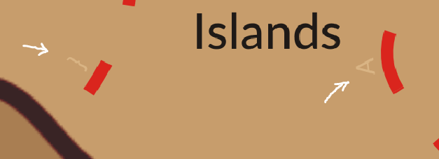

# Treasure map (1 point)

Ahoy, deck cadet,

working with maps and searching for treasures is every sailor's daily routine, right? Your task is to examine the map
and find any hidden secrets.

May you have fair winds and following seas!

Download the [treasure map](treasure_map.zip).
(MD5 checksum: `4f0f6570025ded4d7823739bc963d85e`)

## Hints

* Look for basic steganography tricks.

## Solution

After downloading and extracting archive we see that it contains one image (`treasure_map.png`). If we look at the image
close enough (and/or zoom in) we can see characters written (in light beige) along the red path.

Reading these characters along the path (from the beginning of the path in the upper right corner of the image towards
the X that marks the spot) yields the flag.
