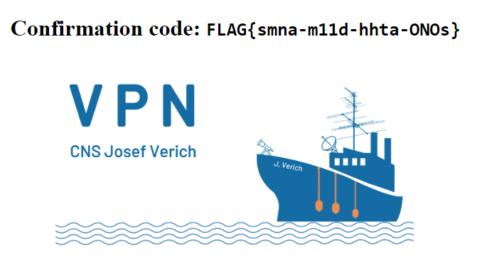

# VPN Access (1 point)

Ahoy, deck cadet,

a lot of ship systems is accessible only via VPN. You have to install and configure OpenVPN properly. Configuration file
can be downloaded from CTFd's link [VPN]. Your task is to activate VPN and visit the testing page.

May you have fair winds and following seas!

Testing page is available at http://vpn-test.cns-jv.tcc.

## Hints

* https://openvpn.net/community-resources/reference-manual-for-openvpn-2-4/
* Do not run more different VPNs at once.

## Solution

It is necessary to download OpenVPN configuration file from the provided address and then start OpenVPN with the
provided configuration file.

After connecting to VPN the testing page becomes available and reveals the flag.

[VPN]: https://www.thecatch.cz/vpn
